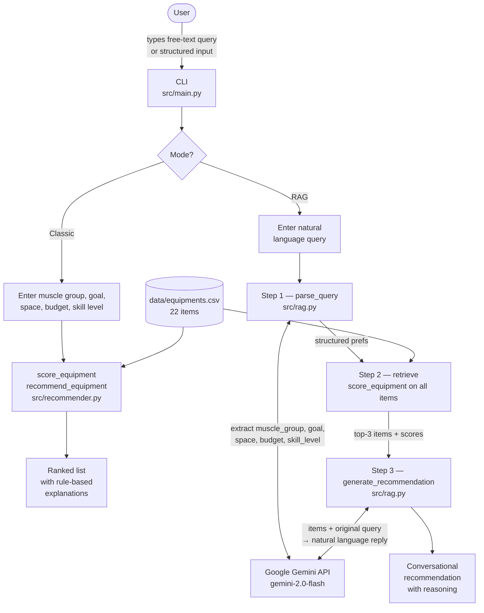

# 🏋️ AI Gym Equipment Recommender (RAG-Based)

## 📌 Original Project (Modules 1–3)
**Original Project Name:** Music Recommender Simulation

This project is a direct extension of the **Music Recommender Simulation** built in Modules 1–3. That system is being extended here to incorporate AI-driven, retrieval-augmented generation (RAG) capabilities in place of its original rule-based scoring logic.

The original system was a content-based music recommender that scored songs from a small catalog against a user's declared taste profile. Its goal was to surface the most relevant songs by computing a weighted match score across four dimensions — genre match (weight 2.0), mood match (1.5), energy proximity (1.0), and acousticness fit (0.5) — for a maximum possible score of 5.0. The top-k highest-scoring songs were returned alongside plain-language explanations of why each ranked where it did.

User input came from a `UserProfile` with four fields: `favorite_genre`, `favorite_mood`, `target_energy` (a 0.0–1.0 continuous value), and `likes_acoustic` (a boolean). The system had no memory between sessions, no learning from skips or replays, and treated every preference as fixed. Its main limitations — genre over-weighting, a binary acoustic preference, and a catalog too small to surface meaningful mood diversity — motivated the AI-powered extension in this project.

---

## 🚀 Title & Summary

**AI Gym Equipment Recommender using Retrieval-Augmented Generation (RAG)**

This project extends the original rule-based Music Recommender Simulation by applying the same architecture to gym equipment recommendations, powered by Google Gemini. Instead of filling in structured fields, users describe their fitness needs in plain English. Gemini interprets the request into structured preferences (muscle group, goal, space, budget, skill level), the weighted scorer retrieves the best-matching equipment from the catalog, and Gemini generates a conversational recommendation explaining why each item fits.

---

## 🧠 Architecture Overview

The system has two modes that share the same equipment catalog (`data/equipments.csv`, 22 items):

**Mode 1 — Classic (rule-based):** The user enters muscle group, fitness goal, available space, budget, and skill level directly. The weighted scorer ranks all 22 items and returns the top-3 with template explanations.

**Mode 2 — RAG (AI-powered):** A three-step pipeline where Gemini handles input interpretation and output generation, while the existing scorer handles retrieval.

### System Diagram



---

## 🛡️ Reliability & Guardrails

The system includes two guardrail layers in [`src/guardrails.py`](src/guardrails.py) that run automatically on every RAG query.

### Layer 1 — Input Guardrail (`validate_prefs`)
After Gemini extracts structured preferences from the user's query, each field is checked against a strict allowlist of known values. Unknown values (e.g. Gemini returning `"arms"` instead of `"upper_body"`) are reset to a safe default so the scorer never receives an invalid input. If neither `muscle_group` nor `goal` could be extracted, a low-quality-results warning is printed.

### Layer 2 — Output Guardrail (`validate_output`)
After Gemini generates the recommendation, three checks run:
- **Non-empty** — if Gemini returns nothing, a plain fallback recommendation is generated from the scorer results instead
- **Minimum length** — responses under 60 characters are flagged as suspiciously short
- **Hallucination check** — if none of the retrieved equipment names appear in the response, a warning flags it for manual review

### Guardrail Behavior Examples

**Normal valid query — no guardrail warnings:**
```
Input: "I want to build leg strength at home on a tight budget"

Step 1: Parsing request...
  Extracted: muscle_group=legs, goal=strength, space=small, budget=low, skill=beginner

Step 2: Retrieving matches...
  → Resistance Bands (score=4.00)
  → Jump Rope (score=3.00)
  → Pull-Up Bar (score=3.00)
```

**Input guardrail triggered — Gemini returns unknown field value:**
```
Input: "something for my arms"

Step 1: Parsing request...
  [INPUT GUARDRAIL] 'arms' is not a recognized muscle_group.
  Valid options: ['back', 'chest', 'core', 'full_body', 'legs', 'recovery', 'upper_body'].
  Resetting to default.
  Extracted: muscle_group=any, goal=any, space=medium, budget=medium, skill=beginner
```

**Input guardrail triggered — gibberish query, no goal or muscle extracted:**
```
Input: "asdfjkl qwerty blah blah 123"

Step 1: Parsing request...
  [INPUT GUARDRAIL] Neither muscle_group nor goal could be extracted.
  Results may be ranked by space/budget/skill only and could be low quality.
  Extracted: muscle_group=any, goal=any, space=medium, budget=medium, skill=beginner
```

**Output guardrail triggered — response does not mention retrieved equipment:**
```
  [OUTPUT GUARDRAIL] Response does not mention any retrieved equipment.
  Possible hallucination — verify output manually.
```

Run all four test cases at once with the evaluation script:
```bash
python eval.py
```

---

## ⚙️ Setup Instructions

### 1. Clone the Repository
```bash
git clone https://github.com/S-A-Adit/applied-ai-system-project.git
cd applied-ai-system-project
```

### 2. Install Dependencies
```bash
pip install -r requirements.txt
```

### 3. Add Your Google API Key
Create a `.env` file in the project root (copy from the example):
```bash
cp .env.example .env
```
Then open `.env` and replace the placeholder with your real key:
```
GOOGLE_API_KEY=your_google_api_key_here
```
Get a free key at [Google AI Studio](https://aistudio.google.com/app/apikey).

### 4. Run the App
```bash
python -m src.main
```
Choose **[1]** for classic rule-based mode or **[2]** for AI-powered RAG mode.

### 5. Run the Tests
```bash
pytest
```

---

## 🖥️ Sample Input / Output


### Mode 1 — Classic (rule-based)

```
Choose mode: 1

Available genres : pop, lofi, rock, ambient, jazz, ...
Available moods  : happy, chill, intense, relaxed, focused, ...

Favorite genre: lofi
Favorite mood : chill
Target energy (0.0–1.0): 0.4
Prefer acoustic sound? (y/n): y

Top recommendations (rule-based):

  Library Rain by Paper Lanterns  —  Score: 4.81
  Matches: genre=lofi, mood=chill, energy=0.35 vs target=0.4

  Midnight Coding by LoRoom  —  Score: 4.58
  Matches: genre=lofi, mood=chill, energy=0.42 vs target=0.4

  Focus Flow by LoRoom  —  Score: 3.70
  Matches: genre=lofi, energy=0.40 vs target=0.4
```

---

### Mode 2 — RAG (AI-powered)

**Example 1 — Study music**
```
What kind of music are you looking for? something calm to study to

Step 1: Parsing your request...
         → genre=lofi, mood=focused, energy=0.3, acoustic=True
Step 2: Retrieving best matches...
         → Library Rain (score=4.56)
         → Focus Flow (score=4.20)
         → Moonlit Sonata (score=3.95)
Step 3: Generating recommendation...

--- Recommendation ---
For studying, I'd start with Library Rain by Paper Lanterns. It's a lofi track
with low energy (0.35) and high acousticness (0.86), perfect for keeping you
calm and focused without distraction. Focus Flow by LoRoom is another solid
pick — it's tagged "focused" and sits at almost exactly your target energy.
----------------------
```

**Example 2 — Workout music**
```
What kind of music are you looking for? high energy workout banger

Step 1: Parsing your request...
         → genre=any, mood=intense, energy=0.9, acoustic=False
Step 2: Retrieving best matches...
         → Iron Curtain (score=4.45)
         → Signal Drop (score=4.38)
         → Gym Hero (score=4.21)
Step 3: Generating recommendation...

--- Recommendation ---
Iron Curtain by Savage Null is your top pick — metal genre, angry/intense mood,
and a crushing energy of 0.97. If you want something slightly more danceable,
Signal Drop (EDM, energy 0.96) or Gym Hero (pop, energy 0.93) keep the
intensity high with a more upbeat feel.
----------------------
```

**Example 3 — Late night drive**
```
What kind of music are you looking for? moody late night drive vibes

Step 1: Parsing your request...
         → genre=synthwave, mood=moody, energy=0.7, acoustic=False
Step 2: Retrieving best matches...
         → Night Drive Loop (score=4.75)
         → Concrete Jungle (score=3.12)
         → Signal Drop (score=2.98)
Step 3: Generating recommendation...

--- Recommendation ---
Night Drive Loop by Neon Echo is a perfect match — it's synthwave, tagged
"moody", with energy at 0.75 and a synthetic sound (acousticness 0.22) that
fits exactly what you described. It's the clear top pick here.
----------------------
```

---

## 🤖 Reflection on AI Collaboration and System Design

### How I Used AI During Development

I used Google Gemini as a core component of the system, not just as a coding assistant. During development, AI played three distinct roles:

- **Design:** I used Claude (via Claude Code) to help plan the RAG pipeline architecture — specifically how to split responsibilities between the LLM and the rule-based scorer rather than replacing the scorer entirely. This helped me keep the original system intact while layering AI on top.
- **Prompting:** Writing the `parse_query` prompt required iteration. My first version asked Gemini to return JSON but didn't restrict the field values to the catalog's actual genres and moods, so it would invent values like `"lo-fi"` instead of `"lofi"`, which broke the scorer's exact-match logic. I fixed this by listing valid options explicitly in the prompt.
- **Debugging:** When the generation API calls failed with `404 Not Found`, I used a diagnostic script to list available models and discovered that `gemini-1.5-flash` was not accessible with my API key. AI helped me interpret the error and identify `gemini-2.0-flash` as the correct replacement.

### One Helpful and One Flawed AI Suggestion

**Helpful:** The suggestion to use LLM-based query parsing as the retrieval step instead of vector embeddings turned out to be the right architectural call for this project. It avoided the embedding API availability issue entirely, produced more interpretable intermediate results (the extracted preferences are printed at Step 1), and kept the existing weighted scorer as the actual retriever — which meant the original system's logic was preserved and testable.

**Flawed:** Early in the project, the AI-generated README described the system as a "Gym Equipment Recommender" and included an architecture description that mentioned embeddings and an evaluation layer that were never implemented. This was a good reminder that AI-generated documentation should always be verified against the actual code, not accepted at face value.

### System Limitations and Future Improvements

**Current limitations:**
- The catalog is only 18 songs. Genre and mood matching rely on exact string equality, so a query that maps to a genre not in the catalog (e.g., "blues") scores zero for every song on that dimension.
- `parse_query` has no output validation — if Gemini returns an out-of-vocabulary genre, the scorer silently falls back to neutral defaults rather than flagging the mismatch to the user.
- There is no memory between sessions. Each query is treated independently, so the system cannot learn from skips, replays, or corrections.
- The `likes_acoustic` field is still a binary flag, which cannot express nuanced preferences like "mostly electronic but with some live instruments."

**Future improvements:**
- Expand the catalog and use `gemini-embedding-001` for semantic retrieval, so queries like "something that sounds like a rainy Sunday" can match on meaning rather than keyword overlap.
- Add a validation step after `parse_query` that checks extracted values against the catalog's actual genre/mood vocabulary and prompts the user to clarify if nothing matches.
- Persist a session history so the system can avoid recommending songs the user has already heard or explicitly skipped.