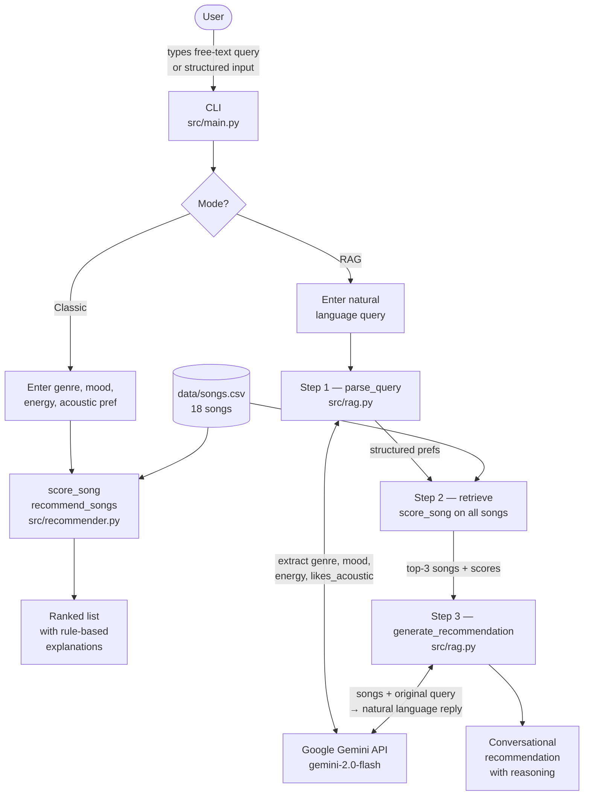
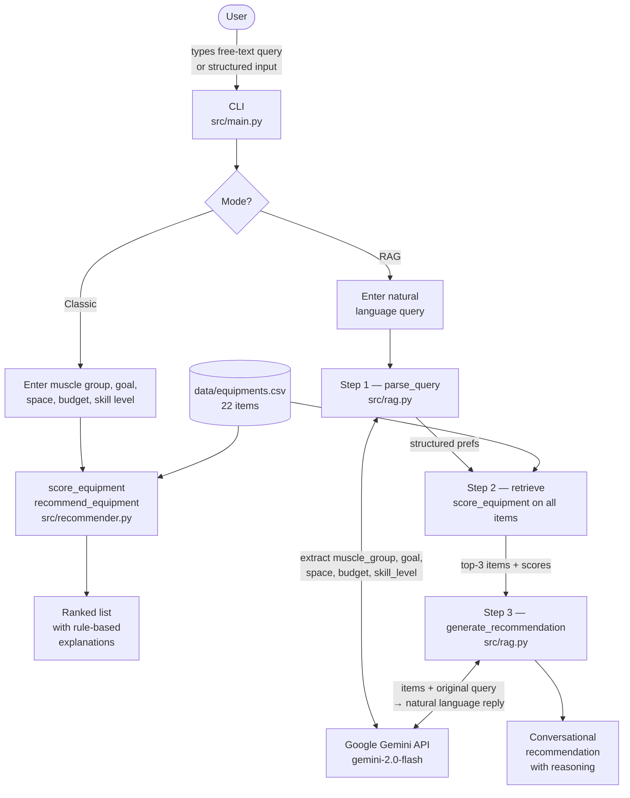

### System Diagram

```mermaid
flowchart TD
    User([User]) -->|types free-text query\nor structured input| CLI[CLI\nsrc/main.py]
    CLI --> Mode{Mode?}

    Mode -->|Classic| CI[Enter genre, mood,\nenergy, acoustic pref]
    Mode -->|RAG| NL[Enter natural\nlanguage query]

    CI --> Scorer1[score_song\nrecommend_songs\nsrc/recommender.py]
    CSV[(data/songs.csv\n18 songs)] --> Scorer1
    Scorer1 --> Out1[Ranked list\nwith rule-based\nexplanations]

    NL --> Step1[Step 1 — parse_query\nsrc/rag.py]
    Step1 <-->|extract genre, mood,\nenergy, likes_acoustic| Gemini[Google Gemini API\ngemini-2.0-flash]

    Step1 -->|structured prefs| Step2[Step 2 — retrieve\nsrc/rag.py]
    CSV --> Step2
    Step2[Step 2 — retrieve\nscore_song on all songs] -->|top-3 songs + scores| Step3[Step 3 — generate_recommendation\nsrc/rag.py]

    Step3 <-->|songs + original query\n→ natural language reply| Gemini

    Step3 --> Out2[Conversational\nrecommendation\nwith reasoning]
```

---
### System Diagram

```mermaid
flowchart TD
    User([User]) -->|types free-text query\nor structured input| CLI[CLI\nsrc/main.py]
    CLI --> Mode{Mode?}

    Mode -->|Classic| CI[Enter muscle group, goal,\nspace, budget, skill level]
    Mode -->|RAG| NL[Enter natural\nlanguage query]

    CI --> Scorer1[score_equipment\nrecommend_equipment\nsrc/recommender.py]
    CSV[(data/equipments.csv\n22 items)] --> Scorer1
    Scorer1 --> Out1[Ranked list\nwith rule-based\nexplanations]

    NL --> Step1[Step 1 — parse_query\nsrc/rag.py]
    Step1 <-->|extract muscle_group, goal,\nspace, budget, skill_level| Gemini[Google Gemini API\ngemini-2.0-flash]

    Step1 -->|structured prefs| Step2[Step 2 — retrieve\nsrc/rag.py]
    CSV --> Step2
    Step2[Step 2 — retrieve\nscore_equipment on all items] -->|top-3 items + scores| Step3[Step 3 — generate_recommendation\nsrc/rag.py]

    Step3 <-->|items + original query\n→ natural language reply| Gemini

    Step3 --> Out2[Conversational\nrecommendation\nwith reasoning]
```
---